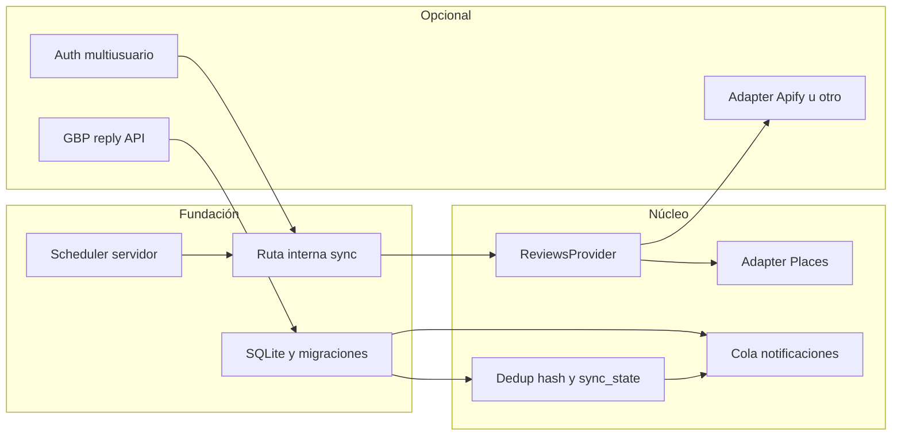

# Plan de Mejoras (unificado)

Documento único que fusiona el plan original con el orden y dependencias optimizados respecto al código actual (`app/page.tsx`: polling en cliente; `app/api/reviews/route.ts`: Places Details; sin base de datos server-side).

---

## Principios del plan óptimo

1. **Scheduler en servidor antes que “más datos”**: Sin un job que ejecute el ciclo aunque el navegador esté cerrado, mejorar solo la UI o añadir Apify no garantiza fiabilidad 24/7.
2. **SQLite como fundación temprana**: Estado de sync, hashes y cola de notificaciones deben apoyarse en tablas; evita JSON intermedio y doble migración.
3. **Abstracción de fuente (`ReviewsProvider`)**: Places como primera implementación; Apify u otros como adapters opcionales cuando el volumen o la fiabilidad lo exijan.
4. **Identificador de reseña**: La API Places Details **no garantiza** un ID estable equivalente al de Google Business Profile. Hay que validar la respuesta real; si falta, usar **identificador derivado** (p. ej. hash canónico: `place_id + time + author + hash(text normalizado)`).
5. **Redis opcional**: Para esta escala basta SQLite; Redis solo si aparece necesidad de cola distribuida o varios workers.

---

## Arquitectura objetivo (visión)



---

## Área 1: Acceso a datos

### Problema

Google no ofrece una API pública gratuita ilimitada para reseñas; Places Details tiene cuotas y limitaciones.

### Opciones

| Opción | Costo | Complejidad | Fiabilidad |
|--------|-------|--------------|------------|
| Google Places API (actual) | Cuota / facturación según proyecto | Baja | Media |
| Apify (scraper) | ~$49/mes | Media | Alta |
| Placeful API | ~$29/mes | Baja | Alta |
| Scraping propio | Gratis (infra propia) | Alta | Baja |

### Propuesta

1. Definir interfaz **`ReviewsProvider`** (obtener reseñas normalizadas para un `place_id`).
2. Implementar **`PlacesReviewsProvider`** (comportamiento actual, encapsulado).
3. Mantener Places como **ruta por defecto**; valorar Apify u otro proveedor **tras** tener persistencia y scheduler (evita pagar sin medir pérdidas reales).
4. Elegir proveedor alternativo según **volumen de locales**, frecuencia de polling y presupuesto (no asumir Apify como único camino “óptimo”).

---

## Área 2: Fiabilidad del polling y del entorno

### Estado actual relevante

El intervalo de comprobación vive en el **navegador** (`setInterval` en el cliente). Si el usuario cierra la pestaña, deja de monitorearse.

### Mejoras

- **Job en servidor**: Vercel Cron, worker en Railway/Render, `node-cron` en proceso dedicado, etc., que invoque una ruta interna de sync (p. ej. `POST /api/internal/sync`) protegida con `CRON_SECRET` o similar.
- **Comparación estable**: Sustituir o reforzar `${author_name}_${review.time}` según campos reales de la API o hash canónico (ver principios).
- **Logging estructurado**: Cada ciclo con timestamp, `place_id`, resultado (éxito / error / vacío).
- **Alertas de fallo**: Notificar (Telegram u otro canal) si **N** ciclos consecutivos fallan.
- **Estado de sincronización**: `last_sync_at`, contadores de error, opcionalmente puntero lógico a última reseña procesada (según estrategia de deduplicación).

### Implementación (resumida)

```
1. Variable de entorno CRON_SECRET; cabecera o query validada en la ruta interna.
2. Scheduler externo llama al endpoint cada X minutos.
3. Por cada negocio activo: fetch → comparar con DB → encolar notificaciones → actualizar sync_state.
4. Errores: log + backoff entre reintentos del mismo ciclo si aplica.
```

---

## Área 3: Detección de cambios

### Mejoras

- **Hash de contenido** (`content_hash`) por reseña almacenada.
- **Revisión completa periódica** (p. ej. cada 24 h): comparar todos los hashes con la última respuesta de la fuente.
- **Soft delete**: Si una reseña deja de aparecer → marcar `deleted_at` o estado `removed`.

### Implementación (resumida)

```
1. Por cada reseña: guardar text_hash / content_hash y metadatos normalizados.
2. Ciclo profundo cada N horas: diff completo contra snapshot actual de la API.
3. Si hash cambió → evento "reseña modificada".
4. Si identificador estable desaparece del listado actual → "reseña eliminada" (soft delete).
```

---

## Área 4: Manejo de notificaciones

### Mejoras

- **Cola en SQLite** (tabla `notifications`): `pending` → `delivered` / `failed`.
- **Retry con backoff**: p. ej. 3 intentos a 1 min, 5 min, 15 min (ajustable).
- **Ack explícito**: No considerar “notificado” hasta `status = delivered` (o equivalente).
- **Dead letter**: Tras N intentos, estado `dead_letter` para inspección manual.

### Implementación (resumida)

```
1. Tabla notifications: id, review_id (o fk), channel, payload, status, retry_count, next_attempt_at, created_at, updated_at.
2. El job de sync solo encola; otro paso del mismo job o mini-worker envía Telegram y actualiza estado.
3. La UI puede seguir existiendo para configuración, pero la verdad operativa vive en servidor + DB.
```

---

## Área 5: Almacenamiento (SQLite)

### Propuesta

Pasar de estado solo en cliente / JSON a **SQLite embebido** (sin servidor de DB aparte).

| Tabla | Descripción |
|-------|-------------|
| businesses | Lugares a monitorear y metadatos |
| reviews | Reseñas vistas, `content_hash`, flags de borrado |
| notifications | Cola y reintentos |
| sync_state | Último estado por negocio (timestamps, errores consecutivos, etc.) |

### Beneficios

- Concurrencia razonable con locks de SQLite.
- Persistencia y consultas coherentes con el job en servidor.
- Base única para cola, deduplicación e historial.

---

## Área 6: Autenticación (opcional según producto)

### Cuándo priorizarlo

- **Instancia única / un negocio**: puede bastar **secreto en servidor** (`CRON_SECRET`, API key interna) hasta que exista multiusuario.
- **SaaS o panel compartido**: entonces JWT / **NextAuth.js** (u otro) con roles (**admin**, **viewer**) tiene sentido.

### Flujo multiusuario (objetivo tardío)

```
1. Usuario se autentica (Google / Telegram / email según decisión de producto).
2. Admin asigna negocios visibles / notificables.
3. Viewer recibe notificaciones según asignación.
```

---

## Área 7: Respuesta a reseñas

### Requisito

Google Business Profile API con **OAuth 2.0** del titular del negocio.

### Propuesta

1. Spike de viabilidad: scopes, tipo de cuenta, revisión Google si aplica.
2. Implementar flujo OAuth y almacenamiento seguro de refresh tokens.
3. Endpoint `POST /api/reviews/{id}/respond` (o similar) y **audit trail** en DB.

**Nota**: Esta fase es la más dependiente de terceros y suele llevar más tiempo del estimado “por código” solo.

---

## Roadmap de ejecución (orden óptimo)

| Fase | Contenido | Estimación orientativa |
|------|-----------|-------------------------|
| **A** | Scheduler en servidor + ruta interna protegida + logging estructurado | 1–2 días |
| **B** | SQLite: esquema, migraciones, `businesses`, `reviews`, `sync_state`, `notifications` | 1–2 días |
| **C** | `ReviewsProvider` + adapter Places; identificador estable o hash canónico; integrar sync con DB | 2 días |
| **D** | Dedupe, `content_hash`, revisión periódica, soft delete | 1–2 días |
| **E** | Cola Telegram: envío, backoff, DLQ | 1–2 días |
| **F** | (Opcional) Adapter Apify u otro proveedor | 1–2 días |
| **G** | (Opcional) Autenticación multiusuario | 2+ días |
| **H** | (Opcional) Respuestas GBP + OAuth | 3+ días (muy variable) |

**Total núcleo (A–E)**: aprox. **7–12 días** según profundidad de tests y despliegue.  
**Fases F–H** se suman según alcance real del producto.

---

## Trade-offs

| Mejora | Costo | Beneficio |
|--------|-------|------------|
| Job en servidor | Infra / configuración | Monitoreo sin pestaña abierta |
| Apify (u otro) | Mensual | Mejor acceso a datos si Places no basta |
| SQLite | Mantenimiento de esquema | Una sola fuente de verdad |
| Cola notificaciones | Desarrollo | Menos pérdidas ante fallos de Telegram |
| Auth completo | Desarrollo | Multiusuario y permisos |
| Respuesta GBP | OAuth + cumplimiento Google | Responder desde la app |

---

## Recomendación de arranque

1. **Fase A**: Sin esto, el resto mejora “la lógica” pero no el cierre del navegador.
2. **Fase B** inmediatamente después: todas las demás piezas encajan en tablas.
3. **Fases C + D + E**: núcleo de producto estable (datos + cambios + notificaciones fiables).
4. **F**: Solo si tras C–E sigue habiendo problemas de datos o cuotas.
5. **G + H**: cuando el modelo de negocio o el roadmap lo requieran; **H** conviene un spike antes de comprometer fecha.

---

## Referencias en el repo

- API reseñas: `app/api/reviews/route.ts`
- Telegram: `app/api/telegram/route.ts`
- Polling UI: `app/page.tsx`
- Limitaciones detalladas: `docs/LIMITACIONES.md`
